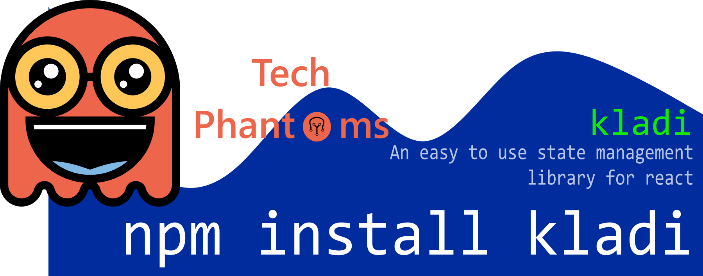

<p align="center">
  <a href="https://www.npmjs.com/package/kladi"></a>

<a href="https://www.npmjs.com/package/kladi"></a>
<a href="https://standardjs.com"></a>
<a href="https://github.com/Ninja-Developers/kladi/blob/master/LICENSE"></a>

</p>

## Install

```bash
npm install --save kladi
```

## Usage

```jsx
import { Provider, useState } from "kladi";

import React from "react";
import ReactDOM from "react-dom";
import App from "./App";

ReactDOM.render(
  <Provider>
    <App />
  </Provider>,
  document.getElementById("root")
);

const App = (props) => {
  let [count, setCount] = useState("count", 0);

  return (
    <div>
      {count}
      <button
        onClick={() => {
          setCount(count + 1);
        }}
      >
        Press
      </button>
    </div>
  );
};

```

## License

MIT © [Ninja-Developers](https://github.com/Ninja-Developers)
